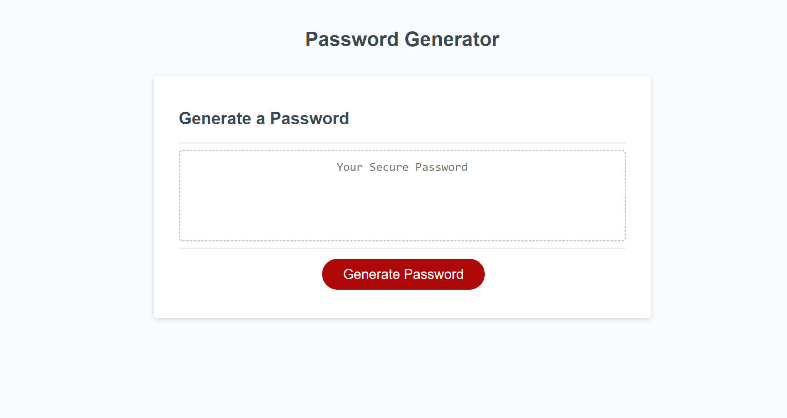
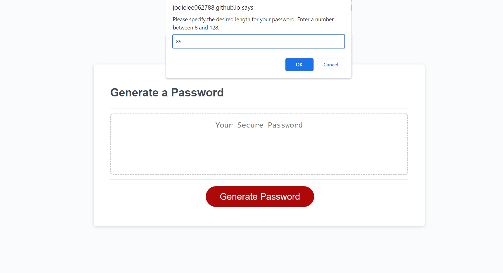
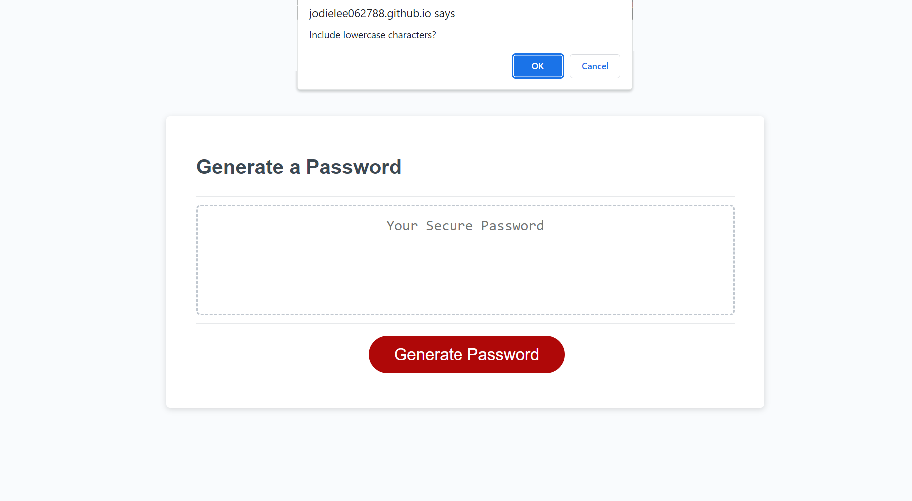
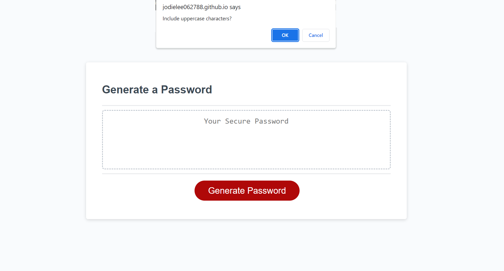
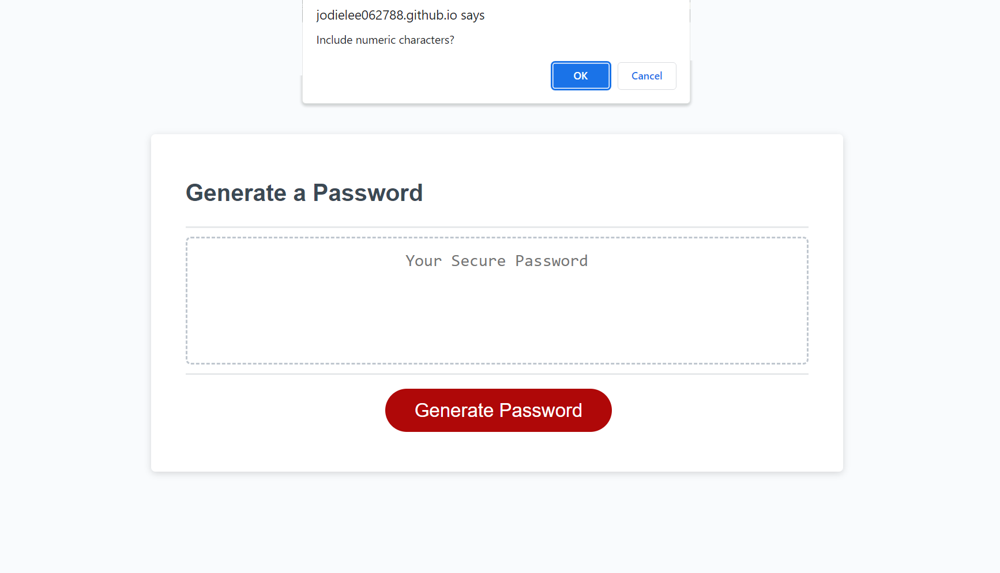
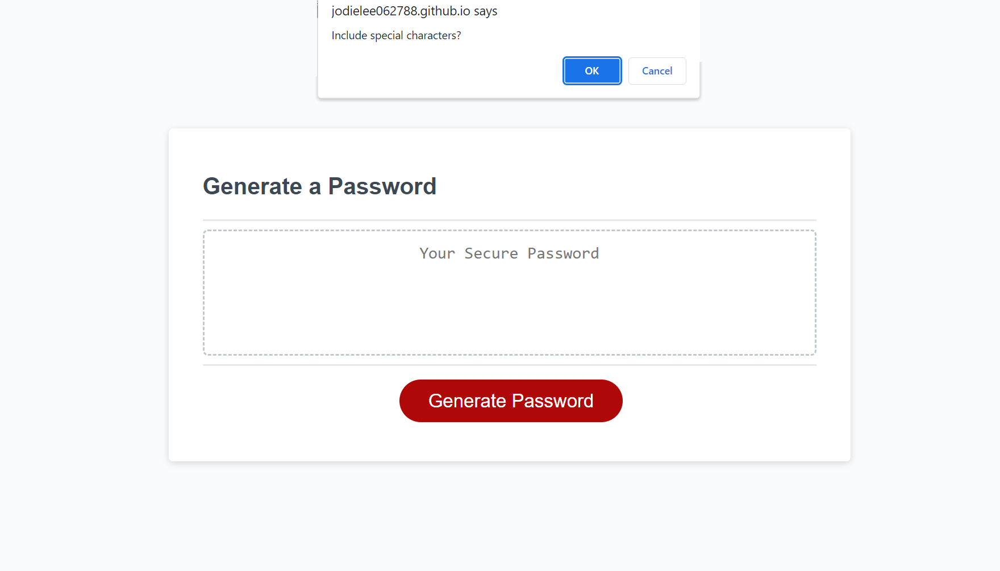
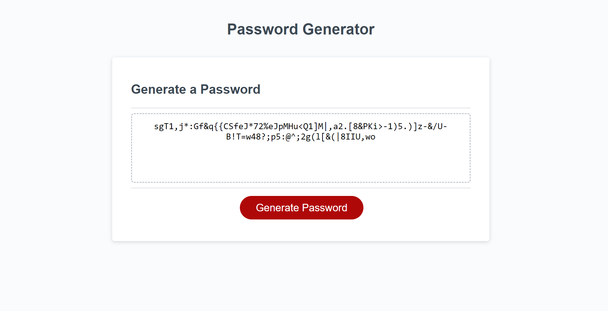

# Password Generator

## Description

This project is a simple password generator that allows users to customize the length and character types of their passwords. It's a practical tool for creating secure and unique passwords based on user preferences. 

The motivation behind building this project was to provide a tool for generating secure and customizable passwords. It aims to simplify the process of generating strong passwords with various character types.

### Problem Solving

The project helps solve the problem of creating strong passwords that meet specific criteria.

### Learning

Throughout the development of this project, I gained valuable insights and skills in the following areas:

- **JavaScript Fundamentals:** Strengthened my understanding of basic JavaScript concepts, such as variables, functions, loops, and conditional statements.

- **DOM Manipulation:** Explored how to interact with the Document Object Model (DOM) to dynamically update and display content on a web page.

- **User Input Validation:** Implemented input validation to ensure that users provide valid and appropriate information when prompted for password criteria.

- **Random Password Generation:** Learned the process of generating random passwords based on user-selected criteria, including character types and length.

## Installation

To install and run this project locally, follow these steps:

1. Clone the repository to your local machine.
    
    git clone git@github.com:jodielee062788/js-password-generator.git

2. Open the project folder in your code editor.
3. Explore the code and open index.html in your web browser.

## Usage

1. Open the Password Generator in a web browser.

    

2. Click the "Generate Password" button.

    

3. Follow the prompts to specify the desired password length and character types.

    Including Lowercase Characters

    Including Uppercase Characters

    Including Numeric Characters

    Including Special Characters

4. View the generated password in the text area.

    

## Live Demo

Check out the live demo of the Password Generator [here](https://jodielee062788.github.io/js-password-generator/).

## Credits

This project was created by Jodie Lee. 

## How to Contribute

If you'd like to contribute to this project, please follow these guidelines:

1. Fork the project.
2. Create a new branch for your feature or bug fix.
3. Commit your changes.
4. Submit a pull request.

